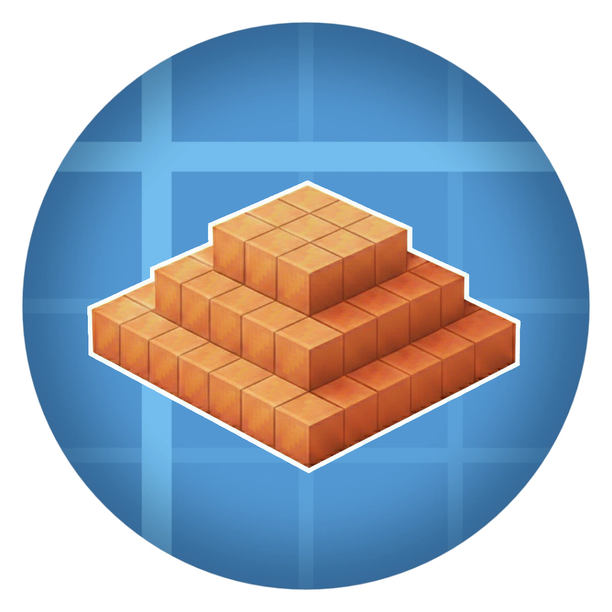

# Copper Beacon

---

## ✨ Features ✨

Adds copper blocks (including all oxidation states and waxed variants) as a valid base for Beacons. Allows using copper ingots as payment and includes a custom interface to display all materials.

✨ Lightweight
 
✨ No configuration required
 
✨ Just install and play

---

✨ <strong>Made with ❤️ for the Minecraft Community</strong> ✨

